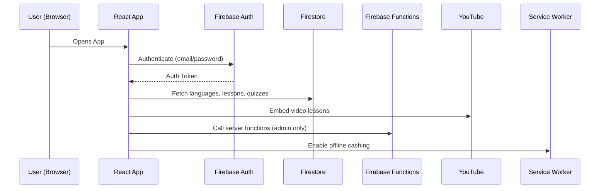
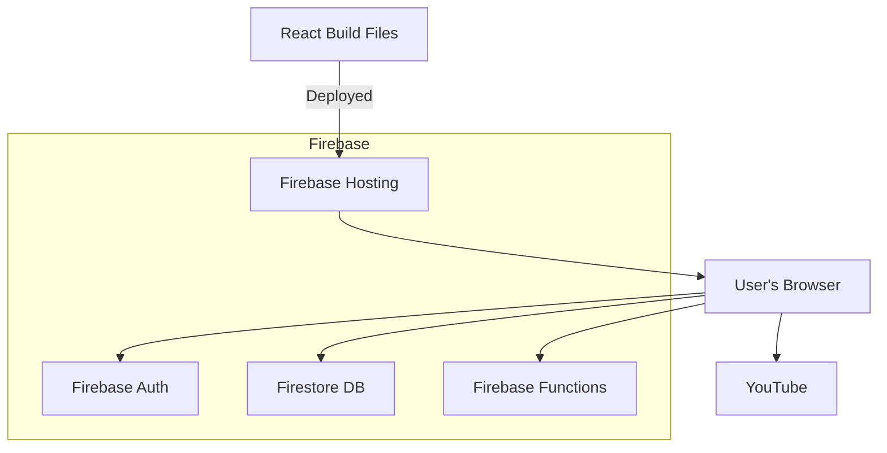

# System Architecture - LingoRoots Language Learning Web App

## 🧭 Overview

The LingoRoots platform is a bilingual (English/French) web application designed to preserve and promote Cameroonian native languages using interactive learning methods. It follows a modular, serverless architecture powered by Firebase.

---

## 🧩 High-Level Components

### 1. **Frontend** – React Application

- Built using React with modular UI components.
- Responsive and accessible (a11y).
- PWA-enabled with offline support (service worker caching).
- Multi-language UI (i18n for English/French).
- UI library: TailwindCSS or Material UI (whichever proves most performant).

### 2. **Backend Services** – Firebase Ecosystem

| Component              | Role |
|------------------------|------|
| **Firebase Hosting**   | Deploys and serves the React web app. |
| **Firebase Auth**      | Handles user authentication (Email/Password for MVP, scalable to Google/OAuth). |
| **Firestore**          | Cloud NoSQL database storing users, progress, lessons, quizzes. |
| **Firebase Functions** | Handles advanced logic such as admin tools, batch processing, or restricted operations. |

---

## 🔐 User Roles & Access Control

| Role             | Access |
|------------------|--------|
| **Learner**       | View lessons, take quizzes, track progress. |
| **Content Creator** | Manage lessons and quizzes through a CMS interface. |
| **Administrator** | Full access including user and language management. |

Authentication and access control are enforced using Firebase Auth and Firestore Security Rules.

---

## 🧠 Interaction Flow



---

## 🌐 External Services

- **YouTube**: Embedded videos used for lesson enhancement.
- **Browser Cache**: Service workers cache essential assets and content for offline access.

---

## 🛠️ CMS & Admin Panel (Built into React App)

- Auth-protected routes (`/cms`, `/admin`) render role-based interfaces.
- Allows creation, editing, deletion of languages, lessons, quizzes.
- Powered by Firestore + Firebase Functions.

---

## 🧱 Suggested Folder Structure

```
src/
│
├── components/         # Reusable UI components
├── pages/              # Route-based views (Home, Lesson, Quiz, CMS)
├── services/           # Firestore & Auth logic
├── utils/              # Helpers, i18n
├── assets/             # Images, videos, icons
└── sw.js               # Service Worker
```

---

## 🚀 Deployment



---

## ✅ Scalability & Future Enhancements

- OAuth login (Google, Facebook)
- AI-driven feedback loops for quiz performance
- Real-time analytics dashboard (using Firebase Analytics or BigQuery)
- Push notifications (via Firebase Cloud Messaging)

---

## 📌 Summary

This architecture balances rapid development with long-term scalability, making use of Firebase's full suite and React’s component-based efficiency.

